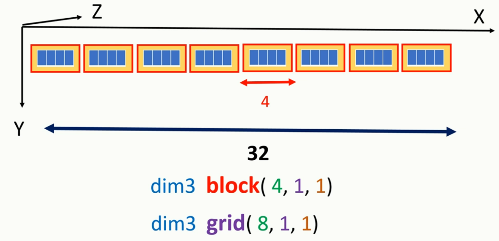

# GPU
**Architektur**

---

**Inhaltsverzeichnis**

---

**GPU Einordnung**

---

**Historische Entwicklung**

---

**GPU Architektur**

---

**Vergleich von GPU und CPU Architektur**

---

**GPU APIs eine Übersicht**

---

**Hello CUDA**

```c++
#include "cuda_runtime.h"
#include "device_launch_parameters.h"

#include <stdio.h>

/**
 * KernelFunktion (Ausführung auf der GPU)
 */
__global__ void hello_cuda() 
{
	printf("Hello CUDA!\n");
}

/**
 * Host Code (Ausführung auf der CPU)
 */

int main() 
{
        hello_cuda <<<1,1>>> (); // Kernel Launch, was ist '<< <1,1> >>' ?  
        cudaDeviceSynchronize(); 
        cudaDeviceReset(); 
	return 0;
}

```
---

## **Modifiers**

**Kernelfunktion**

```c++
__global__ void called_from_host(int* some_data, int size) { ... }
```

**Devicefunktion**

```c++
__device__ int called_from_device(int* some_data, int size) { ... }
```
---

**Modifiers**

```c++

#include "cuda_runtime.h"
#include "device_launch_parameters.h"
#include <string>
#include <stdio.h>

using namespace std;

__device__ const char* part_two() {
    return "CUDA";
}

__device__ const char* part_one() {
    return "Hello";
}

__device__ void result(char* buffer, size_t bufferSize) {
    const char* p1 = part_one();
    const char* p2 = part_two();
    const char* to_append = "!!!";
    
    snprintf(buffer, bufferSize, "%s %s%s", p1, p2, to_append);
}

__global__ void i_am_api()
{
    char buffer[50]; 
    result(buffer, sizeof(buffer));
    printf("%s\n", buffer);
}

// Host Code wie zuvor
```
---

## **Funktionsumfang in CUDA**

GPUs sind primär Rechenmaschinen ihre Stärke liegt in der hohen parallelisierbarkeit einfacher Rechenoperationen

- Eingeschränkte Unterstützung der  C/C++ Standard Libraries

**Stattdessen spezialisierte Libraries wie**:
- cuFFT - CUDA Fast Fourier Transform
- cuDNN - CUDA Deep Neural Network
- Thrust - Parallele Algorithmen Bibliothek
- DALI - NVIDIA Data Loading Library

---

## **Übersicht wichtiger Funktionen der CUDA Runtime API**

```c++
...
cudaDeviceSynchronize();
cudaDeviceReset();
...
```

- `cudaDeviceSynchronize()` vgl. join()
- `cudaDeviceReset()`

---
## **Kernel Launch**

```c++
	hello_cuda <<<a,b>>>(); 
```
- `a: dim3 || int` Grid
- `b: dim3 || int` Block

```c++
dim3 grid, block;
block = dim3(32); // dim3(42,1,1)
grid = dim3(48); // dim3(48,1,1)

hello_cuda <<<grid, block>>>();
```

Ausgabe: 32 * 48 = 1536 mal Hello CUDA 


---
**Kernkonzept**: Thread Organization

Threads werden in **Blöcken** organisiert
- Jeder Block kann höchstens 1024 Threads beinhalten

Blöcke werden in **Grids** organisiert 
- Jeder Block kann auf einem separaten **SM** ausgeführt werden 
- Jedes Grid kann $(2^{31}-1) * 65535 * 65535$ Blöcke beinhalten

<br>

$$\#threads = 1024 * (2^{31}-1) * 65535 * 65535 = 2.305.843.008.139.952.128$$

---

 <!-- .element: style="display: flex" -->

---

<br>

**threadId** ist nur innerhalb eines blocks eindeutig!

```c++
// Launch Konfiguration grid = dim3(48, 1, 1) & block = dim(256, 1, 1)
int gid = blockIdx.x + threadIdx.x
```

```c++
// Launch Konfiguration grid = dim3(48, 48, 1) & block = dim(256, 1, 1)
int tid = threadIdx.x;
int block_offset = blockIdx.x * blockDim.x;
int row_offset = gridDim.x * blockDim.x * blockIdx.y;
int gid = row_offset + block_offset + tid;
```

---

<br>

Abhängig vom Problem benötigen wir keine **gid**

```c++
// Launch Konfiguration grid = dim(48, 48, 1) & block = dim(128, 128, 1)
// Für Matrizenberechnung
int row = blockIdx.y * blockDim.y + threadIdx.y;
int col = blockIdx.x * blockDim.x + threadIdx.x;
```

**Ubersicht wichtiger Funktionen**

- `cudaMalloc(void **devPtr, size_t size)` vgl. malloc()
- `cudaMemcpy(void *dest, void *scr, size_t size, cudaMemcpyKind m)`


**cudaMemcpyKind**

- 


---

**Das CUDA Execution Model**

Das CUDA-Ausführungsmodell nutzt eine hierarchische Organisation von Threads in Warps und Thread Blocks innerhalb eines Grids, die auf Streaming Multiprocessors mit mehreren CUDA-Kernen verteilt werden, um die parallele Verarbeitung zu optimieren und eine hohe Occupancy zu erreichen, wobei jeder Kernel effizient auf der GPU ausgeführt wird.

---

**Die kleinste schedulbare Einheit** - Warp


<br>

**Performance Tipp**: Die Blocksize sollte einem Vielfachen der Warp Size entsprechen um inaktive Threads zu vermeiden 

---

**Warp Divergence**

```c++
__global__ void this_causes_warp_divergence() {
	int tid = threadIdx.x;
	if (tid % 2 == 0) {
		// do something
	} else {
		// do something else
	}
}
```

---

---

**Das CUDA Memory Model**

---

**CUDA Streams**

---

**Klassische Anwendungsgebiete**

---

**Fallbeispiel**

---

**Quellenverzeichnis**


