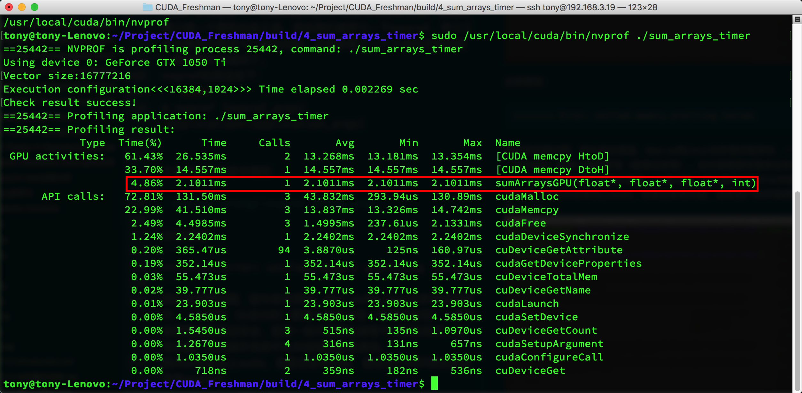
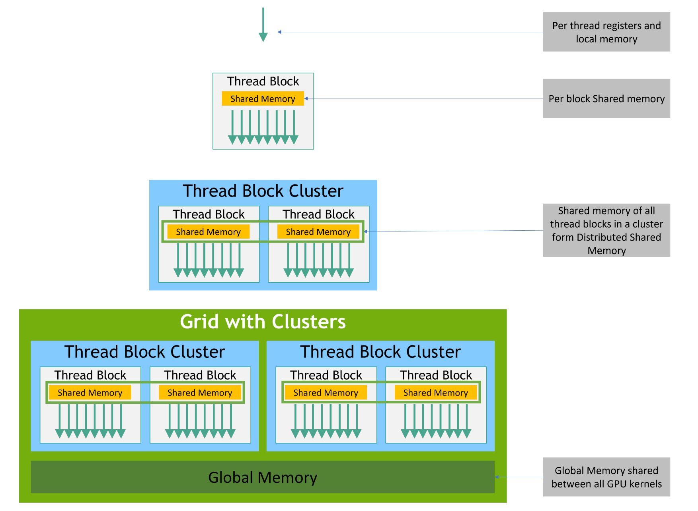
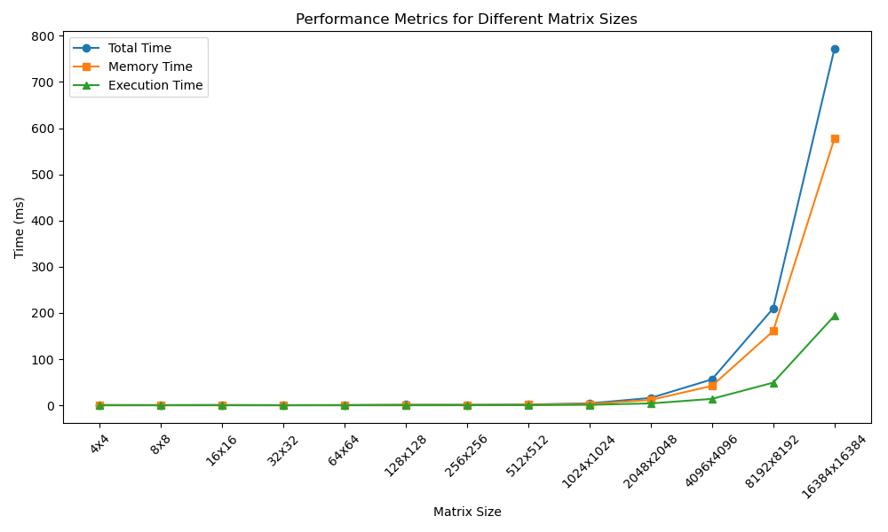
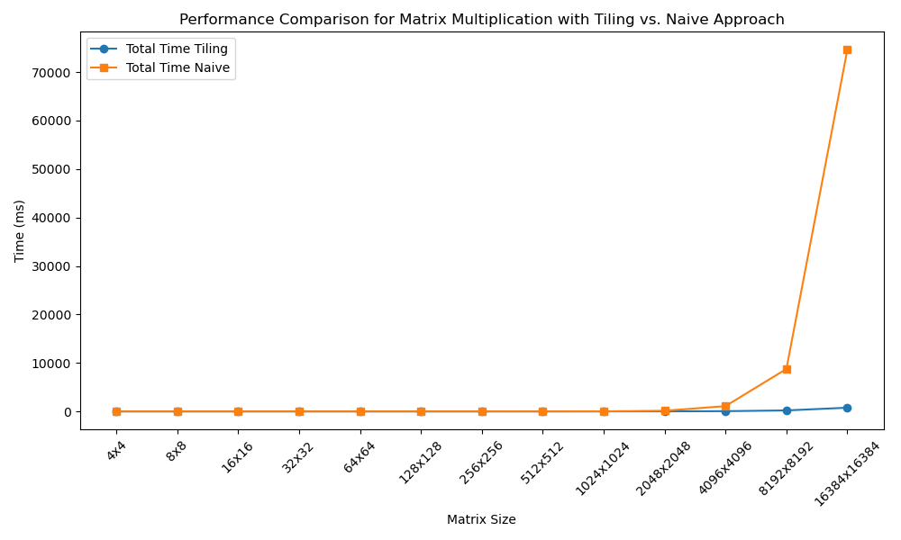
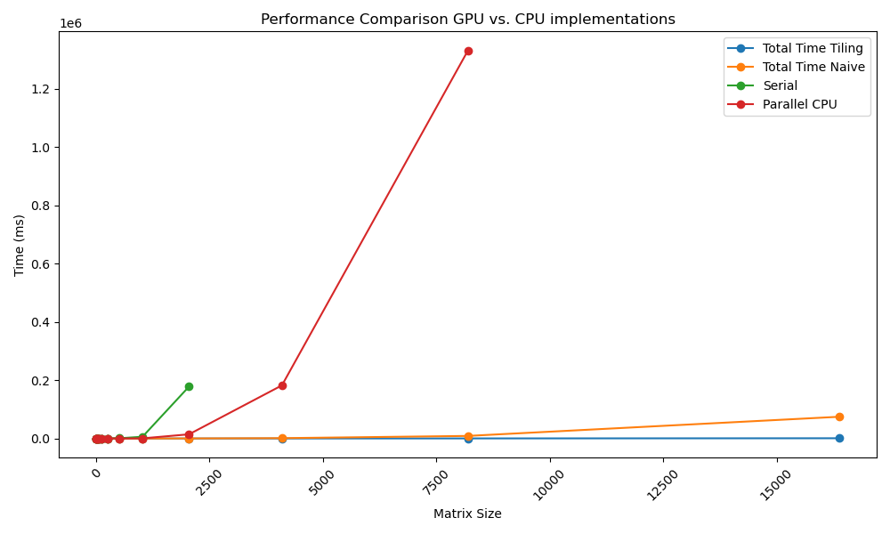
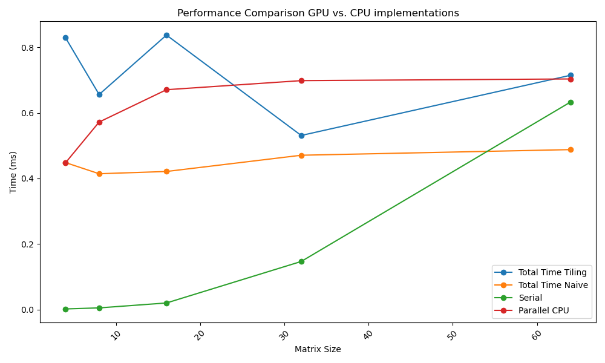

# GPU
---
# &nbsp;&nbsp;&nbsp;&nbsp;&nbsp;&nbsp;&nbsp;&nbsp;&nbsp;&nbsp;&nbsp;&nbsp;&nbsp;&nbsp;&nbsp;&nbsp;&nbsp;&nbsp;&nbsp;&nbsp;&nbsp;&nbsp;**Inhaltsverzeichnis**
##### &nbsp;&nbsp; 1. CPU vs. GPU: Vergleich
##### &nbsp;&nbsp;&nbsp;2. GPU-Beschleunigung und ihre Anwendung
##### &nbsp;&nbsp;&nbsp;3. GPU-APIs
##### &nbsp;&nbsp;&nbsp;4. CUDA - Einführung
##### &nbsp;&nbsp;&nbsp;5. Case Study und Performance Vergleich CPU & GPU 
##### &nbsp;&nbsp;&nbsp;6. Ausblick und Trends


---
# <br><br><br>&nbsp;&nbsp;&nbsp;&nbsp;&nbsp;&nbsp;&nbsp;&nbsp;&nbsp;&nbsp;&nbsp;&nbsp;&nbsp;&nbsp;&nbsp;&nbsp;CPU vs. GPU: Vergleich
---
## **CPU (Central Processing Unit)**
- **Aufgaben:**
  - Durchführung von Berechnungen für vielfältige Anwendungen.
  - Ausführung komplexer, aber nicht parallelisierbarer Aufgaben.
  - Koordination von Systemressourcen.

- **Anwendungsgebiete**
  - Vielseitige Aufgaben in Softwareanwendungen.
  - Betriebssysteme.
  - Datenbankmanagement. 
---
## **GPU (Graphics Processing Unit)**

- **Aufgaben**
  - Optimierung von Grafiken für visuelle Darstellung.
  - Parallele Verarbeitung großer Datensätze.

- **Anwendungsgebiete**
  - Grafikdesign (schnelle Verarbeitung von grafischen Elementen).
  - Simulationen (realistische Darstellung komplexer Szenarien).
  - Künstliche Intelligenz (z. B. Deep Learning).
---
## **CPU vs. GPU: Hardware-Unterschiede**
- **Speicher**
  - CPU: Nutzt den Hauptspeicher (RAM)
  - GPU: Nutzt dedizierten Video-RAM (VRAM)
- **Kerne**
  - CPU: Wenige leistungsstarke Kerne (typischerweise 4-16 Kerne)
  - GPU: Zahlreiche spezialisierte Kerne (Hunderte bis Tausende)
- **Cache**
  - CPU: Größer, für schnellen Zugriff auf allgemeine Daten.
  - GPU: Kleiner, für schnellen Zugriff auf grafikbezogene Daten.
---
# <br><br><br>&nbsp;&nbsp;&nbsp;&nbsp;&nbsp;&nbsp;&nbsp;&nbsp;&nbsp;&nbsp;&nbsp;&nbsp;&nbsp;&nbsp;&nbsp;&nbsp;&nbsp;&nbsp;&nbsp;&nbsp;&nbsp;&nbsp;&nbsp;&nbsp;&nbsp;&nbsp;&nbsp;&nbsp;&nbsp;&nbsp;GPU-APIs
---
# **Eine Übersicht**

- #### CUDA 

- #### OpenCL

- #### ROCm

- #### OpenGL

- #### Vulkan

- #### Metal

- #### SYCL
---
# **CUDA**

- #### Erscheinungsdatum

  - **Erstveröffentlichung:** CUDA wurde erstmals im Juni 2007 eingeführt.
  
  - **Aktuelle Version:** 12.2 (Stand: 28. Juni 2023)

- #### CUDA Compute Capability

  - **Definition:** CUDA Compute Capability bezieht sich auf die Hardware-Generation von NVIDIA GPUs, die CUDA unterstützt.

  - **Aktuellste:** NVIDIA H100	9.0 (Hopper Architektur)
---
# **CUDA**

- #### Marktposition

  - **Dominanz im HPC-Sektor**

  - **Innovation in wissenschaftlichen Anwendungen**
  
  - **Starke Präsenz in der KI-Forschung und -Entwicklung**
  
  - **Bevorzugte Plattform für komplexe KI-Modelle und Deep Learning**

---

# <br><br>**Einführung in die Programmierung mit CUDA**
#### Am Beispiel von Matrixmultiplikation

---

**Hello CUDA**

```c++
#include "cuda_runtime.h"
#include "device_launch_parameters.h"

#include <stdio.h>

/**
 * KernelFunktion (Ausführung auf der GPU)
 */
__global__ void hello_cuda() 
{
	printf("Hello CUDA!\n");
}

/**
 * Host Code (Ausführung auf der CPU)
 */

int main() 
{
        hello_cuda <<<1,1>>> (); // Kernel Launch, was ist '<< <1,1> >>' ?  
        cudaDeviceSynchronize(); 
        cudaDeviceReset(); 
	return 0;
}

```
---

## **Modifiers**

**Kernelfunktion**

```c++
__global__ void called_from_host(int* some_data, int size) { ... }
```

**Devicefunktion**

```c++
__device__ int called_from_device(int* some_data, int size) { ... }
```
---

**Modifiers**

```c++

#include "cuda_runtime.h"
#include "device_launch_parameters.h"
#include <string>
#include <stdio.h>

using namespace std;

__device__ const char* part_two() {
    return "CUDA";
}

__device__ const char* part_one() {
    return "Hello";
}

__device__ void result(char* buffer, size_t bufferSize) {
    const char* p1 = part_one();
    const char* p2 = part_two();
    const char* to_append = "!!!";
    
    snprintf(buffer, bufferSize, "%s %s%s", p1, p2, to_append);
}

__global__ void i_am_api()
{
    char buffer[50]; 
    result(buffer, sizeof(buffer));
    printf("%s\n", buffer);
}

// Host Code wie zuvor
```
---

## **Funktionsumfang in CUDA**

GPUs sind primär Rechenmaschinen ihre Stärke liegt in der hohen parallelisierbarkeit einfacher Rechenoperationen

- Eingeschränkte Unterstützung der  C/C++ Standard Libraries

**Stattdessen spezialisierte Libraries wie**:
- cuFFT - CUDA Fast Fourier Transform
- cuDNN - CUDA Deep Neural Network
- Thrust - Parallele Algorithmen Bibliothek
- DALI - NVIDIA Data Loading Library

---

## **Übersicht wichtiger Funktionen der CUDA Runtime API**

```c++
...
cudaDeviceSynchronize();
cudaDeviceReset();
...
```

- `cudaDeviceSynchronize()` vgl. join()
- `cudaDeviceReset()`

---
## **Kernel Launch**

```c++
	hello_cuda <<<a,b>>>(); 
```

```c++
dim3 grid, block;
block = dim3(32); // dim3(32,1,1) == 32
grid = dim3(48); // dim3(48,1,1) == 48

hello_cuda <<<grid, block>>>();
```

Ausgabe: 32 * 48 = 1536 mal Hello CUDA 


---
## **Thread Organisation**
<br>
<br>

- Blocks
- Grids
- Threads 
---

### Block

Threads werden in **Blöcken** organisiert

- Ein Block läuft auf genau einem (SM).
- Hat eine BlockID (blockIdx.x, blockIdx.y, blockIdx.z)
- Hat eine BlockDim (blockDim.x, blockDim.y, blockDim.y)
- Wird in **Warps** unterteilt

 Für jeden Block gilt: $X \times Y\times Z \leq 1024$ (bzw. 512 abhängig von CC)

---

### Grid
Blöcke werden in **Grids** organisiert 
- Jedes Grid kann $(2^{31}-1) * 65535 * 65535$ Blöcke beinhalten 

<br>

$$\#threads = 1024 * (2^{31}-1) * 65535 * 65535 = 2.305.843.008.139.952.128$$
(theoretisches Maximum CC $\geq$ 7.5)

---

 <!-- .element: style="display: flex" -->

---

### Thread

- Hat eine threadId


**Thread ID** ist nur innerhalb eines Blocks eindeutig

```c++
// Launch Konfiguration grid = dim3(48, 1, 1) & block = dim(256, 1, 1)
int gid = blockIdx.x * blockDim.x + threadIdx.x
```

```c++
// Launch Konfiguration grid = dim3(48, 48, 1) & block = dim(256, 1, 1)
int tid = threadIdx.x;
int block_offset = blockIdx.x * blockDim.x;
int row_offset = gridDim.x * blockDim.x * blockIdx.y;
int gid = row_offset + block_offset + tid;
```

---
**Matrixmultiplaktion: Mit Kernel Launch**

```c++
#include "cuda_runtime.h"
#include "device_launch_parameters.h"
#include "time.h"

__device__ float multiply(float a, float b) {
    return a * b;
}

__global__ void mat_mul() {
    int row = blockIdx.y * blockDim.y + threadIdx.y;
    int col = blockIdx.x * blockDim.x + threadIdx.x;

    // Hier Matrixmutiplikation ausführen

}

void fillMatrix(float *matrix, int width, int height) {
    for (int i = 0; i < height; ++i) {
        for (int j = 0; j < width; ++j) {
            matrix[i * width + j] = (float)rand() / (float)(RAND_MAX / 10);
        }
    }
}

```

---
**Matrixmultiplikation: Mit Kernel Launch**
```c++
int main(void) {
    int matSize = 1000;
    int matSizeBytes = matSize * matSize * sizeof(float);
    srand(time(NULL));

    float *matrixA, *matrixB, *result;
    *matrixA = (float *)malloc(matSizeBytes);
    *matrixB = (float *)malloc(matSizeBytes);
    *result = (float *)malloc(matSizeBytes);    
    
    if (matrixA == NULL || matrixB == NULL || result == NULL) {
        fprintf(stderr, "Speicherzuweisung fehlgeschlagen.\n");
        return 1;
    }
    fillMatrix(matrixA, matSize, matSize);
    fillMatrix(matrixA, matSize, matSize);
    
    dim3 blockSize(10,10);
    dim3 gridSize((matSize + blockSize.x-1)/blockSize.x, (matSize + blockSize.y-1)/blockSize.y);

    // Wie übergeben wir die Matrix bzw. allgemein Werte an die GPU?
    mat_mul <<<gridSize, blockSize>>>();

    cudaDeviceSynchronize();
    cudaDeviceReset();
}
```
---

## **Übersicht wichtiger Funktionen**

- `cudaMalloc(void **devPtr, size_t size)` vgl. malloc()
- `cudaMemcpy(void *dest, void *scr, size_t size, cudaMemcpyKind m)`
- `cudaFree()` vgl. free()


**cudaMemcpyKind**

- cudaMemcpyHostToHost
- cudaMemcpyHostToDevice
- cudaMemcpyDeviceToHost
- cudaMemcpyDeviceToDevice

---
**Matrixmultiplaktion: Mit Datenübertragung**

```c++
#include "cuda_runtime.h"
#include "device_launch_parameters.h"
#include "time.h"

__global__ void mat_mul(float *matA, float *matB, float *res, int size) {
    int row = blockIdx.y * blockDim.y + threadIdx.y;
    int col = blockIdx.x * blockDim.x + threadIdx.x;

    if (row < size && col < size) {
        float sum = 0.0;
        for (int k = 0; k < size; k++) {
            sum += multiply(matA[row * size + k], matB[k * size + col]);
        }
        res[row * size + col] = sum;
    }
}


```

---
**Matrixmultiplaktion: Mit Datenübertragung** 
```c++
int main(void) {
    int matSize = 1000;
    int matSizeBytes = 1000 * 1000 * sizeof(float);

    srand(time(NULL));

    float *h_matA, *h_matB, *h_res, *d_matA, *d_matB, *d_res;
   
    h_matA = (float *)malloc(matSizeBytes);
    h_matB = (float *)malloc(matSizeBytes);
    h_res = (float *)malloc(matSizeBytes);    
    
    if (h_matA == NULL || h_matB == NULL || h_res == NULL) { fprintf(stderr, "Speicherzuweisung fehlgeschlagen.\n");
        return 1;
    }
    fillMatrix(h_matA, matSize, matSize);
    fillMatrix(h_matB, matSize, matSize);

    cudaMalloc((void**)&d_matA, matSizeBytes); // Speicherallokation auf dem Device
    cudaMalloc((void**)&d_matB, matSizeBytes);
    cudaMalloc((void**)&d_res, matSizeBytes);
    //...
```

---
**Matrixmultiplikation: mit Datenübertragung**
```c++
    //...
    cudaMemcpy(d_matA, h_matA, matSizeBytes, cudaMemcpyHostToDevice); // Von Host zu Device
    cudaMemcpy(d_matB, h_matB, matSizeBytes, cudaMemcpyHostToDevice);

    dim3 blockSize(10,10);
    dim3 gridSize((matSize + blockSize.x-1)/blockSize.x, (matSize + blockSize.y-1)/blockSize.y);

    mat_mul <<<gridSize, blockSize>>>(d_matA, d_matB, d_res, matSize);

    cudaDeviceSynchronize();
    cudaMemcpy(h_res, d_res, matSizeBytes, cudaMemcpyDeviceToHost); // Von Device zu Host
    cudaFree(d_matA); cudaFree(d_matB); cudaFree(d_res); // Speicherfreigabe Device
    free(h_matA); free(h_matB); free(h_res); // Speicherfreigabe Host
    cudaDeviceReset();
}
```

---
##### **Error Handling**


```c++
cudaError_t status = cudaMalloc((void**)&devicePtr, size);
if (status != cudaSuccess) {
    fprintf(stderr, "cudaMalloc failed: %s\n", cudaGetErrorString(status));
    // Fehlerbehandlung...
}

// Was wenn nichts zurückgegeben wird?

a_kernel_function<<<grid, blocks>>>(...);

cudaError_t status = cudaGetLastError();
if (status != cudaSuccess) {
    fprintf(stderr, "Kernel launch failed: %s\n", cudaGetErrorString(status));
    // Fehlerbehandlung
}
```

---
#### **Abfragen von Hardwareinformationen über cudaDeviceProp** 

```c++
void query_device() {
	int devNo = 0;     
	cudaDeviceProp iProp;     
	cudaGetDeviceProperties(&iProp, devNo);      
	printf("Anzahl der MP: %d\n", iProp.multiProcessorCount);     
	printf("Max Anzahl von Threads pro MP: %d\n", iProp.maxThreadsPerMultiProcessor);   
	printf("Warp-Größe: %d\n", iProp.warpSize);     
	printf("Warps pro MP: %d\n", iProp.maxThreadsPerMultiProcessor / iProp.warpSize); 
}
```
```
Ausgabe:
Anzahl der Multiprozessoren: 48 
Maximale Anzahl von Threads pro Multiprozessor: 1536 
Warp-Größe: 32 
Maximale Anzahl von Warps pro Multiprozessor: 48
```


---
## **Das CUDA Execution Model**

- **Warps**
- **SIMT**
- **Warp Divergence**
- **Warp Synchronisierung**
- **Schlussfolgerungen**

---

### Die kleinste schedulbare Einheit - Warp

- Jeder Block wird in **Warps** zu je 32 Threads unterteilt.
- Warps werden nach **SIMT** ausgeführt
- Warps teilen sich **gemeinsamen Speicher** innerhalb eines SM
- Es werden jeweils immer 4 Warps allokiert

Können einen der folgenden Zustände annehmen:

- *selected* (vgl. running)
- *eligible* (vgl. ready)
- *stalled* (vgl. blocked)

---
### Warp & Blocksize
<br>


- 

- Blocksize von 40
- Gridsize von 2

Insgesamt 50 ungenutzte Threads

---
### Ausführungsmodell SIMT

Single Instruction Multiple Threads (spezialfall von SIMD)
- Alle Threads innerhalb eines Warps werden synchron ausgeführt

**SIMT** bedeutet ...

- **Single instruction, multiple register sets**
- **Single instruction, multiple addresses**
- **Single instruction, multiple flow paths**

---

### Warp Divergence

Control flow statements mit divergierenden Pfaden (innerhalb eines Warps).

```c++
__global__ void this_causes_warp_divergence() {
	int tid = threadIdx.x;
	if (tid % 2 == 0) {
		// do something
	} else {
		// do something else
	}
}
```
---

### Warp Divergence


Divergierende Pfade werden seriell ausgeführt.

**Performanceverlust: 50%**

---

### Warp Divergence

```c++
__global__ void this_does_not_cause_warp_divergence() {
    // Jeder Threadblock hat 64 Threads
    int tid = blockIdx.x * threadIdx.x;

    if (tid / 32 < 1) {
        // do something
    } else {
        // do something else
    }
}
```
---

### Warp Synchronisierung

Warps innerhalb eines Blocks nicht notwendigerweise synchron!

Synchronisierung erfolgt mittels:
`__syncthreads()` (vgl. pthread_barrier_wait(...))

```c++
__global__ void modifyArray(int *data, int n) {
    int index = blockIdx.x * blockDim.x + threadIdx.x;
    data[index] += 1;
    __syncthreads();
    if (index % 2 == 0) {
        data[index] *= 2;
    }
}
```
<style>
    section {

    }
</style>
---

### Schlussfolgerungen

- Warps entsprechen Threads in klassischer Programmierung
- Blocksize = $X \times Warpsize$ vermeidet nutzlose Threads
- Control Flow Statements - Warp Divergence vermeiden
- Warps innerhalb eines Blocks keine synchrone Ausführung


---

### **Profiling Tools** 

- **Nsight Compute**
- **nvprof** (Commandline Tool für Cuda Capability < 7.5)


---
### Nvidia Nsight Compute


---

### Nvidia nvprof



---
 **Matrixmultiplikation: Anpassung der Blockgröße**
```c++
int main(void) {
    int matSize = 1024; // Neue größe Teilbar durch 32 - vermeidung von überprüfung im Kernel
    //...
    dim3 blockSize(16,16); // 16 * 16 = 256 % 32 == 0
    dim3 gridSize((matSize + blockSize.x-1)/blockSize.x, (matSize + blockSize.y-1)/blockSize.y);
    //...
```

---
## **Das CUDA Memory Model**

Speicherhierarchien:
- **local memory & registers (thread)**
- **shared memory (thread block)**
- distributed shared memory (thread block clusters) 
    (NVIDIA Hopper Architektur)
- **global memory (shared between all gpu kernels)**
---

**NVIDIA Hopper Architecture**
Thread Block Clusters als neue Abstraktionsebene 
- Einführung von DSMEM innerhalb von Thread Block Clustern

---

### Local- vs Shared- vs Global-Memory 

| Memory Type | Location | Cached | Access | Scope                  | Lifetime       |
|-------------|----------|--------|--------|------------------------|----------------|
| Register    | On-chip  | n/a    | R/W    | 1 thread               | Thread         |
| Local       | Off-chip | Yes*   | R/W    | 1 thread       | Thread         |
| Shared      | On-chip  | n/a    | R/W    | All threads in block   | Block          |
| Global      | Off-chip | Yes*      | R/W    | All threads + host     | Host allocation|

 \* Implementierung Abhängig von CC

---

### Local- vs Shared- vs Global-Memory 

Speicherzugriffszeit:

- registers (wenige Taktzyklen)
- shared memory (einige dutzend Taktzyklen)
- global memory (einige hundert Taktzyklen, bei Cache Miss) 
- local memory (einige hundert Taktzyklen, bei Cache Miss) 

---

### Besondere Speicherbereiche

- Zero Copy Memory
- Constant Memory
- Texture Memory

---

**Zero Copy Memory**
- Liegt im Host Speicher
- Ist sowohl von GPU als auch CPU addressierbar
- Vermeidung von Overhead durch das kopieren vieler (kleiner) Daten


Zugriff langsamer als Device Speicher (über PCIe für externe GPU)

```c++
cudaHostAlloc((void**)&hostPtr, size, cudaHostAllocMapped);
cudaHostGetDevicePointer(&devicePtr, hostPtr, 0);

myKernel<<<blocks, threads>>>(devicePtr);
```

---

**Constant Memory**
- Liegt im globalen Speicher
- Zugriffe werden durch Constant-Cache beschleunigt

Speicher für konst. Daten welche von vielen Threads gelesen werden.
```c++
__constant__ float constData[256];

__global__ void myKernel(float *data) {
    int i = threadIdx.x;
    float val = constData[i];
}
// Kopieren von Daten in den Constant Memory
cudaMemcpyToSymbol(constData, hostData, sizeof(float) * 256);
```
---
**Texture Memory**

- Nutzt Texture Cache, optimiert für räumlich lokale Speicherzugriffe
- Hardware unterstützte Interpolation

Häufig eingesetzt in der Bildverarbeitung
```c++
texture<float, cudaTextureType1D, cudaReadModeElementType> texRef;

__global__ void myKernel(float *output, int size) {
    int i = threadIdx.x;
            output[i] = tex1Dfetch(texRef, i);
}
// Binden des globalen Speichers an den Texture Reference
cudaBindTexture(NULL, texRef, deviceData, sizeof(float) * size);
```
---

## **Tiling**

Prinzip aus der Computergrafik
- Aufteilung größerer Datenmenge in kleinere unabhängig zu bearbeitende Datensätze

In unserem Fall:
- Aufteilung größerer Datenmengen in Tiles
- Effiziente Nutzung des Shared Memory Tiles werden in Shared Memory geladen
- Verringerung der Zugriffe auf den global memory

---

**Performance Optimierung mit Tiling**

- Im Folgenden Laden der Daten aus dem globalen Speicher in den shared memory
- Synchronisierung aller threads mittels `__syncthreads()` um Fehlerhafte berechnungen zu vermeiden
- Verwendung des Shared Memory anstelle des globalen Speichers

---

**Matrixmultiplikation: Mit Tiling**

```c++
#include "cuda_runtime.h"
#include "device_launch_parameters.h"
#include "time.h"

#define TILE_DIM 16; // Tile Dimension (16 * 16 = 256) Optimale Blockgröße

//...

__global__ void mat_mul(float *matA, float *matB, float *res, int size) {
    __shared__ float aTile[TILE_DIM][TILE_DIM], bTile[TILE_DIM][TILE_DIM];
    int row = blockIdx.y * blockDim.y + threadIdx.y;
    int col = blockIdx.x * blockDim.x + threadIdx.x;

    if (row < size && col < size) {
         float sum = 0.0;
        aTile[threadIdx.y][threadIdx.x] = matA[row*TILE_DIM+threadIdx.x]; // Laden der globalen Daten in die Tiles
        bTile[threadIdx.y][threadIdx.x] = matB[threadIdx.y*TILE_DIM+col];
        __syncthreads(); // Wichtig! Synchronisierung nach Speicheroperationen!

        for (int i = 0; i < TILE_DIM; i++) {
            sum += multiply(aTile[threadIdx.y][i], bTile[i][threadIdx.x]);
        }
        
        res[row * N + col] = sum;
    }
}

//...
int main(void) {

    //...
    dim3 blockSize(TILE_DIM,TILE_DIM);
    //...
}

```

---

### Performance Boost durch Reduktion globaler Speicherzugriffe

Im Falle von Tiling: $2 \cdot size * size$
```c++
aTile[threadIdx.y][threadIdx.x] = matA[row*TILE_DIM+threadIdx.x]; // Laden der globalen Daten in die Tiles
bTile[threadIdx.y][threadIdx.x] = matB[threadIdx.y*TILE_DIM+col];
```

Ohne Tiling: $2 * size * size * size$
```c++
for (int k = 0; k < size; k++) {
    sum += multiply(matA[row * size + k], matB[k * size + col]);
}
```
Für *16384x16384* ~900.000.000.000 mehr globale Speicherzugriffe

---
## **Best Practices**

1. Vermeidung von **Warp Divergenz** ***
2. **Profiling** der Anwendung zum Aufspüren von Bottlenecks & Hotspots ***
3. Auslagern schwer zu parallelisierenden Codes auf den Host ***
4. Vermeidung von unnötigen **Datentransfers** zwischen Host und Device ***
5. Verwendung von **Shared Memory** um unnötige Zugriffe auf Global Memory zu vermeiden**

---

**Performance GPU with Tiling**



---

**Performance Vergleich Tiling vs Naive**




---

**Performancevergleich CPU vs. GPU**



---

**Performancevergleich CPU vs. GPU**



---
# <br><br>&nbsp;&nbsp;&nbsp;&nbsp;&nbsp;&nbsp;&nbsp;&nbsp;GPU-Beschleunigung und ihre
# &nbsp;&nbsp;&nbsp;&nbsp;&nbsp;&nbsp;&nbsp;&nbsp;&nbsp;&nbsp;&nbsp;&nbsp;&nbsp;&nbsp;&nbsp;&nbsp;&nbsp;&nbsp;&nbsp;&nbsp;&nbsp;&nbsp;&nbsp;&nbsp;Anwendungen
---
## **GPU-Beschleunigung für Deep Learning**
- #### Deep Learning
  - Training komplexer neuronaler Netzwerke.
  - GPUs beschleunigen durch parallele Berechnungen.
  - Matrixmultiplikationen profitieren von paralleler GPU-Verarbeitung.
  
---
## **GPU-Beschleunigung für Deep Learning**
- ##### CuDNN (CUDA Deep Neural Network Library)
  - NVIDIA's GPU-optimierte Deep Learning-Bibliothek.
  - Maßgeschneidert für Deep Learning.
  - Effiziente GPU-Algorithmen, insbesondere für CNNs.
  
---
## **GPU-Beschleunigung für Deep Learning**
- #### PyTorch
  - Flexibles und dynamisches Deep Learning-Framework.
  - Nutzt GPU-Beschleunigung für effizientes Training von neuronalen Netzwerken.
  - Insbesondere in der Forschung weit verbreitet.

---
## **GPU-Beschleunigung für Deep Learning**
- #### Tensorflow
  - Open-Source-Framework für maschinelles Lernen.
  - Integrierte GPU-Unterstützung für effizientes Training.
  - Branchenführer für industrielle Anwendungen.

---
##  **GPU Beschleunigung für NLP**
- #### Sequenzielle Modelle
  - GPU-Beschleunigung von Transformer-Modellen für maschinelles Übersetzen und Sprachmodellierung.

- #### Textverarbeitung
  - Beschleunigung von NLP-Aufgaben wie Tokenisierung.

---
##  **GPU Beschleunigung für Crypto-Mining**
- **Mining**
  - Mining ist der Prozess, bei dem Transaktionen verifiziert und zur Blockchain hinzugefügt werden.

- **Effizienzsteigerung**
  - GPU-Einsatz verbessert die Energieeffizienz im Vergleich zu herkömmlichen Methoden.

&nbsp;&nbsp;&nbsp;&nbsp;&nbsp;&nbsp;&nbsp;
---
---
# <br><br><br>&nbsp;&nbsp;&nbsp;&nbsp;&nbsp;&nbsp;&nbsp;&nbsp;&nbsp;&nbsp;&nbsp;&nbsp;&nbsp;&nbsp;&nbsp;&nbsp;&nbsp;&nbsp;Ausblick und Trends
---
## **GPU-Architekturen der Zukunft**
- **Innovative Fortschritte**
  - Neue Technologien wie Tensor Cores und Ray Tracing, verspricht Leistungssteigerung.

- **Optimierung für Machine Learning**
  - Tensor Cores ermöglichen optimierte Berechnungen, was zu schnellerem und effizienterem Machine Learning führt.

- **Grafikanwendungen und Realismus**
  - Ray Tracing verbessert die Grafikdarstellung für realistischere visuelle Erlebnisse.
---
## **Neue Anwendungsfelder**
- **Medizin**
  - In der medizinischen Bildgebung für schnellere Diagnosen und komplexe Bildverarbeitung.

- **Finanztechnologie**
  - Einsatz in der Finanzbranche für Analysen, Risikobewertungen und Algorithmen im Hochfrequenzhandel.

- **Robotik**
  - GPU-Einsatz in der Robotik für Sensordatenverarbeitung und komplexe Steuerungsalgorithmen.

---
**Quellenverzeichnis**

    CPU vs. GPU: Vergleich
    https://ark.intel.com
    https://www.nvidia.com
    CPU vs. GPU: Hardware-Unterschiede
    https://www.anandtech.com
    GPU-Beschleunigung für Deep Learning
    https://developer.nvidia.com/deep-learning
    https://www.tensorflow.org/guide/gpu
    https://pytorch.org/get-started/locally/

---

    GPU Beschleunigung für NLP
    https://www.deepspeed.ai/
    https://developer.nvidia.com/blog/nlp-architects-guide-to-ai-acceleration-with-tensorcore/
    GPU Beschleunigung für Crypto-Mining
    https://en.bitcoin.it/wiki/Mining 
    https://ethereum.org/
    GPU-Architekturen der Zukunft
    https://www.nvidia.com/en-gb/research/
    Neue Anwendungsfelder
    https://www.ncbi.nlm.nih.gov/pmc/articles/PMC3496509/
    https://www.nvidia.com/en-us/industries/finance/ai-trading-brief/
    https://developer.nvidia.com/blog/cuda-spotlight-gpu-accelerated-guidance-and-control-robotic-systems/
    Threadorganisation
    https://docs.nvidia.com/cuda/cuda-c-programming-guide/
    https://docs.nvidia.com/cuda/cuda-c-programming-guide/index.html#programming-model
    SIMT vs SIMD
    https://yosefk.com/blog/simd-simt-smt-parallelism-in-nvidia-gpus.html
    https://docs.nvidia.com/cuda/cuda-c-programming-guide/index.html#simt-architecture
    Speicherhierarchie
    https://resources.nvidia.com/en-us-tensor-core/gtc22-whitepaper-hopper
    https://docs.nvidia.com/cuda/cuda-c-best-practices-guide/index.html
    Tiling
    https://docs.nvidia.com/cuda/cuda-c-best-practices-guide/index.html

---

Bildverzeichnis:

    https://bitcoin.org/img/icons/logo-footer.svg?1702235293
    https://upload.wikimedia.org/wikipedia/commons/2/2d/Tensorflow_logo.svg
    https://wissenstransfer.innohub13.de/wp-content/uploads/2021/04/wissenstransfer_NLP_TitelIllustration.svg
    https://bfirst.tech/wp-content/uploads/2022/04/konwolucyjne-sieci.svg
    https://upload.wikimedia.org/wikipedia/commons/4/4d/OpenCL_logo.svg
    https://www.nvidia.com/content/dam/en-zz/Solutions/about-nvidia/logo-and-brand/01-nvidia-logo-vert-500x200-2c50-l@2x.png
    https://upload.wikimedia.org/wikipedia/commons/thumb/1/12/SYCL_logo.svg/1200px-SYCL_logo.svg
    https://avatars.githubusercontent.com/u/16900649?s=200&v=4
    https://upload.wikimedia.org/wikipedia/commons/f/fe/Vulkan_logo.svg
    https://upload.wikimedia.org/wikipedia/commons/c/c6/PyTorch_logo_black.svg
    https://docs.nvidia.com/cuda/cuda-c-programming-guide/_images/grid-of-thread-blocks.png
    https://face2ai.com/CUDA-F-2-2-%E6%A0%B8%E5%87%BD%E6%95%B0%E8%AE%A1%E6%97%B6/
    https://docs.nvidia.com/cuda/cuda-c-programming-guide/index.html#memory-hierarchy

